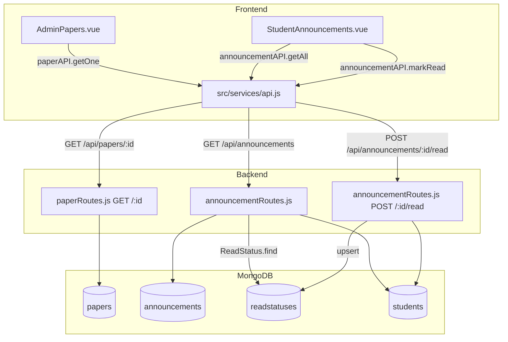

# Design Document — Admin Paper Access & Notifications

## Overview

This feature delivers three targeted improvements to AttendPro:

1. **Admin Paper View/Print** — Admins can already list all papers but the `AdminPapers.vue` view has no "View" button. We add a modal that fetches the paper via the existing `GET /api/papers/:id` route (which already passes admin through) and renders the same A4 preview template used in `TeacherPaperPrint.vue`, with a print action and no edit controls.

2. **Persistent Read-Status Tracking** — A new `ReadStatus` MongoDB collection records when each student opens an announcement. The `GET /api/announcements` route is enriched to attach an `isRead` boolean per announcement for student requests. A new `POST /api/announcements/:id/read` endpoint upserts the record. The student UI shows a pulsing red badge on unread cards and clears it optimistically on click.

3. **Announcement Class Filtering & UI Restyle** — The existing student filter in `announcementRoutes.js` already queries by class at the DB level. The `StudentAnnouncements.vue` page is restyled with a dark-neon purple theme (`#121026` background, `#1b163d` cards, `#7148fc` accent).

### Key Design Decisions

- **No backend change for paper permissions** — `GET /api/papers/:id` already skips the 403 for admins (the ownership check is guarded by `req.user.role === 'teacher'`). Only the frontend needs a View button.
- **Upsert for idempotence** — `ReadStatus` uses `findOneAndUpdate` with `upsert: true` and a compound unique index so duplicate reads are safe.
- **Optimistic UI** — `ann.isRead` is set to `true` in local state immediately on click; the API call is fire-and-forget. If it fails, the badge stays on next page load (server state wins on refresh).
- **Inline A4 template in modal** — The paper preview HTML is duplicated inline in `AdminPapers.vue` rather than extracted to a shared component, keeping the diff minimal and avoiding a refactor of `TeacherPaperPrint.vue`.

---

## Architecture



---

## Components and Interfaces

### Task 1 — Admin Paper View/Print

#### `AdminPapers.vue` changes

- Add `viewingPaper` ref (initially `null`). When set to a paper object, a modal overlay renders.
- Add `loadingPaper` ref for the fetch spinner on the button.
- Each paper card gets a **"View / Print"** button (eye icon). On click: call `paperAPI.getOne(p._id)`, store result in `viewingPaper`.
- Modal structure:
  - Full-screen overlay (`fixed inset-0 bg-black/60 z-50`)
  - Centered white container with max-width `900px`, scrollable
  - Header row: title + **Print** button + **Close** button
  - Body: the A4 preview `div` (same HTML as `#paper-preview` in `TeacherPaperPrint.vue`)
  - Hidden `<iframe id="admin-print-frame">` for the same iframe-print logic
- No `<input>`, `<select>`, `<textarea>`, or edit buttons inside the modal.
- `sectionTotal(section)` helper is duplicated in the component script (same formula as TeacherPaperPrint).

#### `paperAPI` — no change needed

`paperAPI.getOne(id)` already exists in `src/services/api.js`.

---

### Task 2 — ReadStatus Backend

#### New file: `backend/models/ReadStatus.js`

```js
const mongoose = require('mongoose')
const readStatusSchema = new mongoose.Schema({
  announcementId: { type: mongoose.Schema.Types.ObjectId, ref: 'Announcement', required: true },
  studentId:      { type: mongoose.Schema.Types.ObjectId, ref: 'Student',      required: true },
  readAt:         { type: Date, default: Date.now },
})
readStatusSchema.index({ announcementId: 1, studentId: 1 }, { unique: true })
module.exports = mongoose.model('ReadStatus', readStatusSchema)
```

#### Modified: `backend/routes/announcementRoutes.js`

**GET `/api/announcements`** — student path additions:

1. After fetching announcements with the existing class filter, collect `announcementIds`.
2. Query `ReadStatus.find({ studentId: student._id, announcementId: { $in: announcementIds } })`.
3. Build a `Set` of read IDs, then map each announcement to add `isRead: Boolean`.

Admin/teacher path: unchanged — no `isRead` field attached.

**New route: POST `/:id/read`**

```
protect → authorize('student') → find Student by userId → upsert ReadStatus → return { success: true }
```

- Uses `findOneAndUpdate({ announcementId, studentId }, { $setOnInsert: { readAt: new Date() } }, { upsert: true, new: true })`.
- Returns 200 whether it created or found an existing record.
- Returns 404 if the announcement doesn't exist (optional guard).

#### Modified: `src/services/api.js`

Add to `announcementAPI`:
```js
markRead: (id) => api.post(`/announcements/${id}/read`),
```

---

### Task 3 — Student Announcements UI Restyle

#### `StudentAnnouncements.vue` changes

- Replace Tailwind utility classes with inline styles using the dark-neon palette:
  - Page wrapper: `background: #121026`
  - Cards: `background: #1b163d; border: 1px solid #2d2660`
  - Accent text/icons: `color: #7148fc`
- Red pulsing badge: `v-if="!ann.isRead"` — absolutely positioned red circle with `animate-pulse`.
- "View" click handler: calls `announcementAPI.markRead(ann._id)` (fire-and-forget), then `ann.isRead = true`.
- All existing data fields (title, content, priority, targetClass, createdByName, createdAt) preserved.

---

## Data Models

### ReadStatus (new)

| Field           | Type     | Required | Notes                                      |
|-----------------|----------|----------|--------------------------------------------|
| `announcementId`| ObjectId | Yes      | Ref: `Announcement`                        |
| `studentId`     | ObjectId | Yes      | Ref: `Student`                             |
| `readAt`        | Date     | No       | Default: `Date.now`                        |

Compound unique index on `{ announcementId: 1, studentId: 1 }` prevents duplicates and makes upsert safe.

### Announcement (enriched response shape for students)

The existing `Announcement` document is unchanged. The GET response for students gains a virtual field:

| Field    | Type    | Source                                      |
|----------|---------|---------------------------------------------|
| `isRead` | Boolean | `true` if a ReadStatus doc exists for this student + announcement pair |

### Paper (unchanged)

No schema changes. The existing `GET /api/papers/:id` route already returns the full document to admins.

---

## Correctness Properties

*A property is a characteristic or behavior that should hold true across all valid executions of a system — essentially, a formal statement about what the system should do. Properties serve as the bridge between human-readable specifications and machine-verifiable correctness guarantees.*

### Property 1: Admin paper fetch returns full document

*For any* Paper document in the database, a request authenticated as `role === 'admin'` to `GET /api/papers/:id` SHALL return HTTP 200 with the complete paper object, regardless of which teacher owns it.

**Validates: Requirements 1.1**

---

### Property 2: ReadStatus upsert is idempotent

*For any* valid `announcementId` and `studentId` pair, calling `POST /api/announcements/:id/read` N times (N ≥ 1) SHALL result in exactly one ReadStatus document in the database with that pair.

**Validates: Requirements 2.2, 2.3**

---

### Property 3: isRead enrichment is correct for students

*For any* student and any set of announcements visible to that student, the `GET /api/announcements` response SHALL attach `isRead: true` to every announcement for which a ReadStatus document exists for that student, and `isRead: false` to all others.

**Validates: Requirements 2.4**

---

### Property 4: Announcement class filter excludes other classes

*For any* student with class `C` and any set of announcements in the database, `GET /api/announcements` SHALL return only announcements where `targetClass === 'All'` or `targetClass === C`, and SHALL NOT return announcements targeted at any other class.

**Validates: Requirements 3.1**

---

### Property 5: Unread badge presence matches isRead state

*For any* announcement object rendered in `StudentAnnouncements.vue`, the red pulsing badge element SHALL be present if and only if `ann.isRead === false`.

**Validates: Requirements 2.6, 2.8**

---

### Property 6: View action marks announcement as read in local state

*For any* announcement with `isRead === false`, triggering the "View" action in `StudentAnnouncements.vue` SHALL immediately set `ann.isRead = true` in local component state without a page reload.

**Validates: Requirements 2.7**

---

### Property 7: Restyled card preserves all announcement fields

*For any* announcement object, the rendered card in the restyled `StudentAnnouncements.vue` SHALL display all of: `title`, `content`, `priority`, `targetClass`, `createdByName`, and `createdAt`.

**Validates: Requirements 4.5**

---

## Error Handling

| Scenario | Behaviour |
|---|---|
| `GET /api/papers/:id` — paper not found (admin) | 404 `{ success: false, message: "Paper not found." }` |
| `GET /api/papers/:id` — teacher accessing another teacher's paper | 403 `{ success: false, message: "Access denied." }` |
| `paperAPI.getOne` fails in `AdminPapers.vue` | Show toast alert "Failed to load paper", modal does not open |
| `POST /api/announcements/:id/read` — non-student role | 403 from `authorize('student')` middleware |
| `POST /api/announcements/:id/read` — no linked Student doc | 404 `{ success: false, message: "Student profile not found." }` |
| `announcementAPI.markRead` fails in `StudentAnnouncements.vue` | Silently ignored — badge stays, no blocking error shown to user |
| `GET /api/announcements` — student with no linked Student doc | `{ success: true, announcements: [] }` (existing behaviour preserved) |
| MongoDB upsert race condition on ReadStatus | Compound unique index causes duplicate key error on second insert; `findOneAndUpdate` with `upsert: true` handles this safely |

---

## Testing Strategy

### Unit / Example Tests

- `GET /api/papers/:id` with admin token → 200 + paper (Requirement 1.1)
- `GET /api/papers/:id` with teacher token for another teacher's paper → 403 (Requirement 1.2)
- `GET /api/papers/:id` with admin token for non-existent ID → 404 (Requirement 1.3)
- `POST /api/announcements/:id/read` with teacher token → 403 (Requirement 2.1)
- `GET /api/announcements` with admin token → no `isRead` field on any announcement (Requirement 2.5)
- `GET /api/announcements` with admin/teacher → all announcements returned, no class filter (Requirement 3.3)
- `GET /api/announcements` with student having no linked Student doc → empty array (Requirement 3.2)
- `AdminPapers.vue` modal open → no `<input>`, `<select>`, `<textarea>`, or save/generate buttons present (Requirement 1.5)
- `AdminPapers.vue` modal close → `viewingPaper` is `null`, `papers` array unchanged (Requirement 1.6)

### Property-Based Tests

Uses [fast-check](https://github.com/dubzzz/fast-check) (JavaScript). Each test runs a minimum of 100 iterations.

**Property 1 — Admin paper fetch returns full document**
Tag: `Feature: admin-paper-access-notifications, Property 1: admin fetch returns full document`
Generate: random paper payloads (subject, class, semester, totalMarks, sections array). For each, insert into DB, fetch as admin, assert 200 + all fields match.

**Property 2 — ReadStatus upsert is idempotent**
Tag: `Feature: admin-paper-access-notifications, Property 2: ReadStatus upsert is idempotent`
Generate: random (announcementId, studentId) pairs, random repeat count N (1–10). Call POST /read N times, assert exactly 1 ReadStatus document exists.

**Property 3 — isRead enrichment is correct**
Tag: `Feature: admin-paper-access-notifications, Property 3: isRead enrichment is correct`
Generate: random student, random set of announcements (some with ReadStatus, some without). Call GET /announcements, assert each announcement's `isRead` matches whether a ReadStatus exists.

**Property 4 — Announcement class filter excludes other classes**
Tag: `Feature: admin-paper-access-notifications, Property 4: class filter excludes other classes`
Generate: random student class string, random announcements with varying `targetClass` values. Call GET /announcements as that student, assert every returned announcement has `targetClass === 'All'` or `targetClass === studentClass`, and assert no announcement for a different class is present.

**Property 5 — Unread badge presence matches isRead state**
Tag: `Feature: admin-paper-access-notifications, Property 5: badge presence matches isRead`
Generate: random announcement objects with `isRead` set to `true` or `false`. Mount `StudentAnnouncements.vue` with the generated list, assert badge element exists iff `isRead === false`.

**Property 6 — View action marks as read in local state**
Tag: `Feature: admin-paper-access-notifications, Property 6: view action marks as read`
Generate: random announcement objects with `isRead === false`. Mount component with mocked `announcementAPI.markRead`, trigger view action, assert `ann.isRead === true` immediately.

**Property 7 — Restyled card preserves all fields**
Tag: `Feature: admin-paper-access-notifications, Property 7: card preserves all fields`
Generate: random announcement objects with arbitrary title, content, priority, targetClass, createdByName, createdAt. Mount component, assert all six fields appear in the rendered output.
