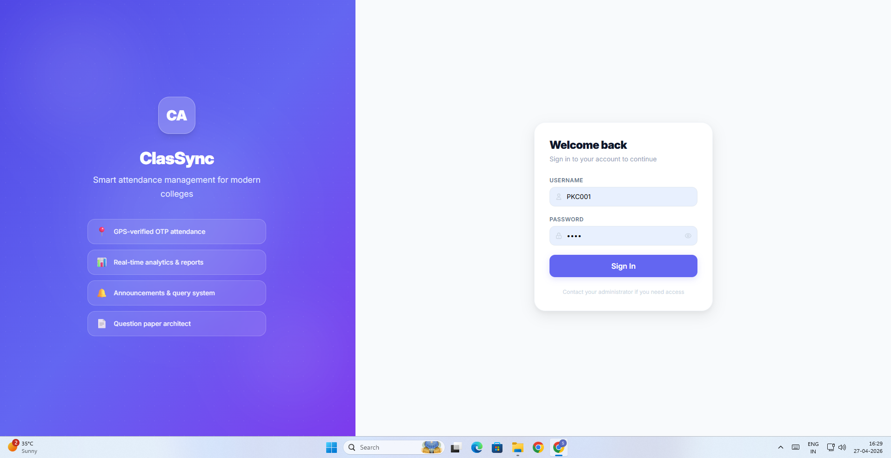
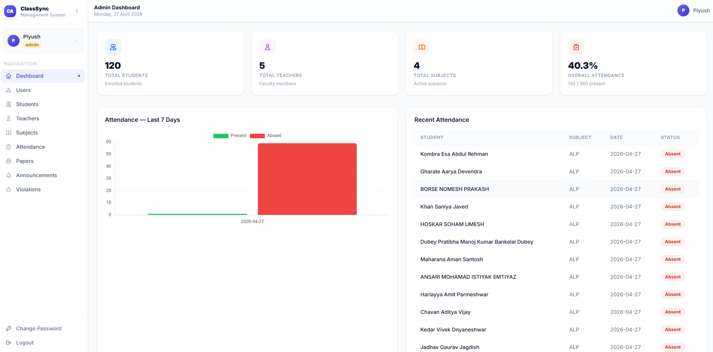
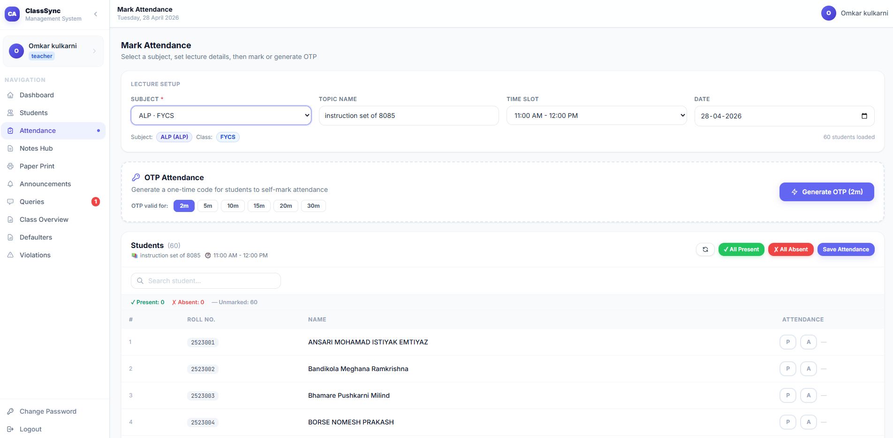
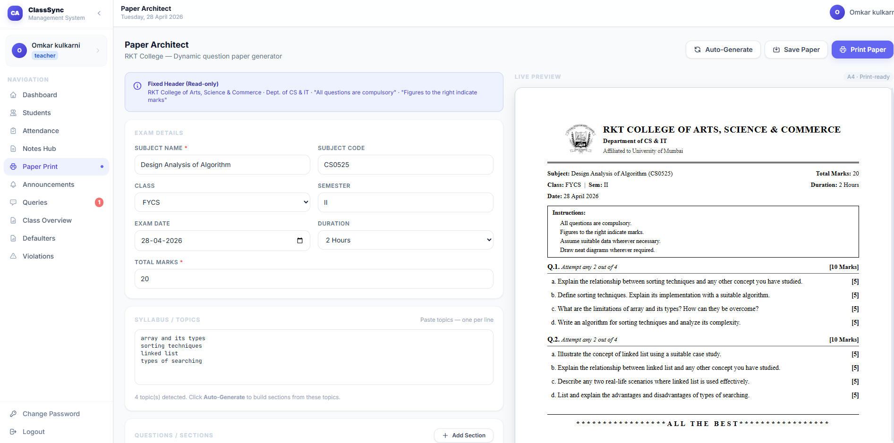
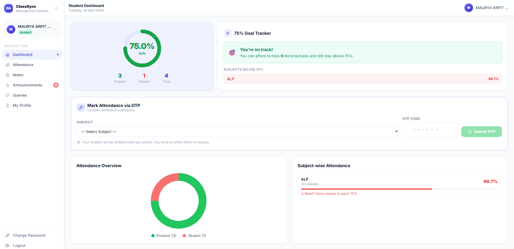
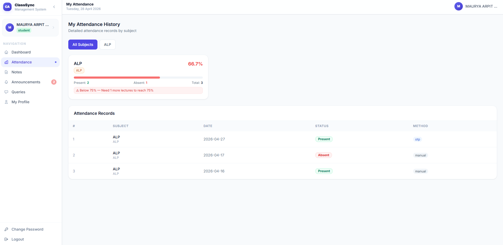

# 🚀 ClassSync - AI Attendance & Question Paper System

## 🌐 Live Demo

🔗 https://rkt-un.netlify.app
🔗 Admin Panel: https://rkt-un.netlify.app/admin

---

## 📌 Overview

ClassSync is a full-stack academic management system designed to automate attendance and generate AI-based question papers using secure verification and intelligent automation.

---

## 🔐 Role-Based Access System

The system supports **three types of users**, each with dedicated functionalities:

### 👨‍💼 Admin

* Manage students and teachers
* Monitor overall attendance analytics
* Send announcements to all users
* System-level control and data management

### 👨‍🏫 Teacher

* Generate OTP for attendance
* Track student attendance records
* Generate AI-based question papers
* Upload notes and study materials

### 🎓 Student

* Mark attendance using OTP + location verification
* View attendance status (Safe / Warning)
* Access study materials
* Raise queries and receive announcements

---

## 🔥 Key Features

* 📍 Geo-Fencing Attendance (100m campus radius)
* 🔐 OTP-based secure attendance verification
* 🤖 AI-powered Question Paper Generation (Hugging Face API)
* 📊 Admin Dashboard with analytics & reports
* 📢 Announcement & Query Management System
* 📱 Fully responsive (Mobile + Web App)

---

## 🛠 Tech Stack

* **Frontend:** Vue.js 3, Tailwind CSS
* **Backend:** Node.js, Express.js (Hosted on Railway)
* **Database:** MongoDB Atlas
* **AI Integration:** Hugging Face API
* **Deployment:** Netlify + Railway

---

## 📸 Screenshots


### 🏠 Login Page


### 📊 Admin Dashboard


### 👨‍🏫 Teacher Attendance & OTP


### 🤖 AI Question Generator


### 🎓 Student Dashboard


### 📊 Attendance Status



---

## 🚀 How to Run Locally

```bash
git clone https://github.com/your-username/ClassSync.git
npm install
npm run dev
```

---

## 🎯 Use Case

This system helps institutions to:

* Prevent proxy attendance using OTP + location verification
* Automate question paper generation using AI
* Improve communication between students and faculty

---

## 👨‍💻 Author

**Prince Singh**
Software Developer | Full Stack | AI-based Applications

---
